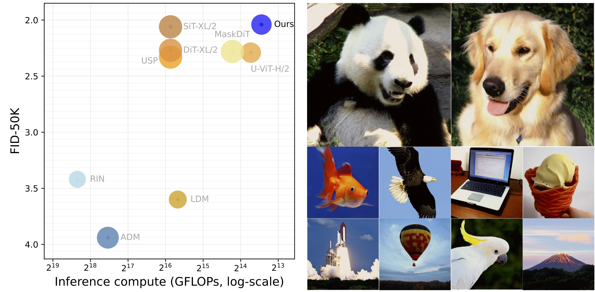

# Official Codes for "Advancing End-To-End Pixel-Space Generative Modeling Via Self-Supervised Pre-Training"
> Abstract: Pixel-space generative models are often more difficult to train and generally underperform compared to their latent-space counterparts, leaving a persistent performance and efficiency gap. In this paper, we introduce a novel two-stage training framework that closes this gap for pixel-space diffusion and consistency models. In the first stage, we pre-train encoders to capture meaningful semantics from clean images while aligning them with points along the same deterministic sampling trajectory, which evolves points from the prior to the data distribution. In the second stage, we integrate the encoder with a randomly initialized decoder and fine-tune the complete model end-to-end for both diffusion and consistency models. Our training framework demonstrates strong empirical performance on ImageNet dataset. Specifically, our diffusion model reaches an FID of 2.04 on ImageNet-256 and 2.35 on ImageNet-512 with 75 number of function evaluations (NFE), surpassing prior pixel-space methods by a large margin in both generation quality and efficiency while rivaling leading VAE-based models at comparable training cost. Furthermore, on ImageNet-256, our consistency model achieves an impressive FID of 8.82 in a single sampling step, significantly surpassing its latent-space counterpart. To the best of our knowledge, this marks the first successful training of a consistency model directly on high-resolution images without relying on pre-trained VAEs or diffusion models. 

(Left) Our pixel-space diffusion model achieves state-of-the-art generation quality with less inference cost. The x-axis indicates the log-scaled GFLOPs for generating an image. The bubble size denotes number of model parameters. (Right) Images generated by our diffusion model.

We are cleaning up our codes and will release them soon.
